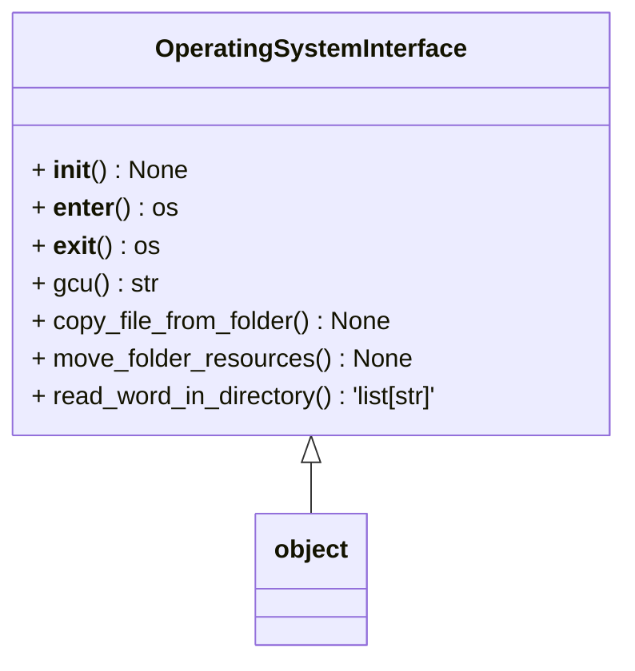

```mermaid
classDiagram
   OperatingSystemInterface <|-- object
   OperatingSystemInterface : + __init__() None
   OperatingSystemInterface : + __enter__() os
   OperatingSystemInterface : + __exit__() os
   OperatingSystemInterface : + gcu() str
   OperatingSystemInterface : + copy_file_from_folder() None
   OperatingSystemInterface : + move_folder_resources() None
   OperatingSystemInterface : + read_word_in_directory() 'list[str]'
```
        