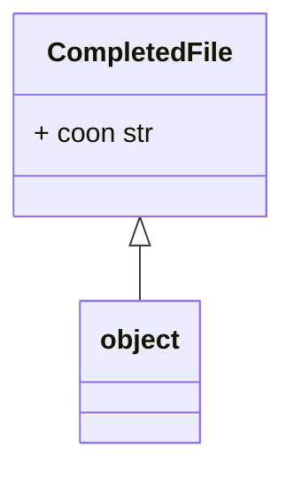
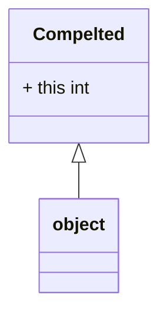
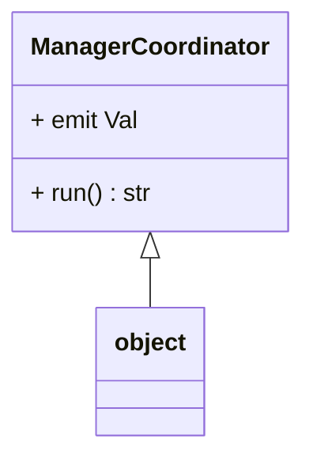

```mermaid
classDiagram
   CompletedFile <|-- object
   CompletedFile : + coon str
```
        

```mermaid
classDiagram
   Compelted <|-- object
   Compelted : + this int
```
        

```mermaid
classDiagram
   ManagerCoordinator <|-- object
   ManagerCoordinator : + emit Val
   ManagerCoordinator : + run() str
```
        