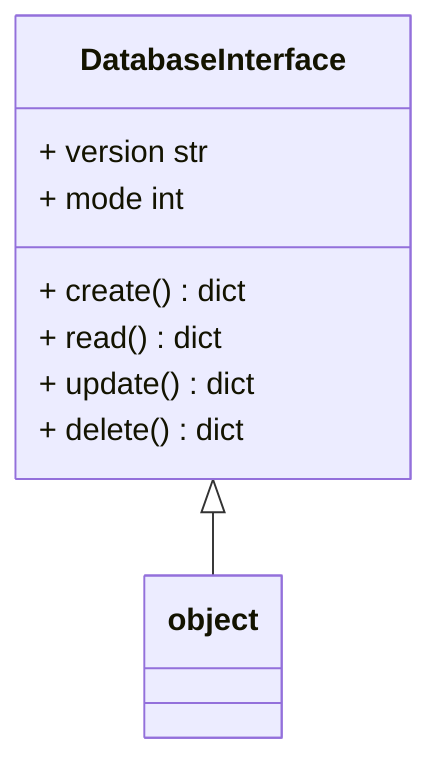

```mermaid
classDiagram
   DatabaseInterface <|-- object
   DatabaseInterface : + version str
   DatabaseInterface : + mode int
   DatabaseInterface : + create() dict
   DatabaseInterface : + read() dict
   DatabaseInterface : + update() dict
   DatabaseInterface : + delete() dict
```
        