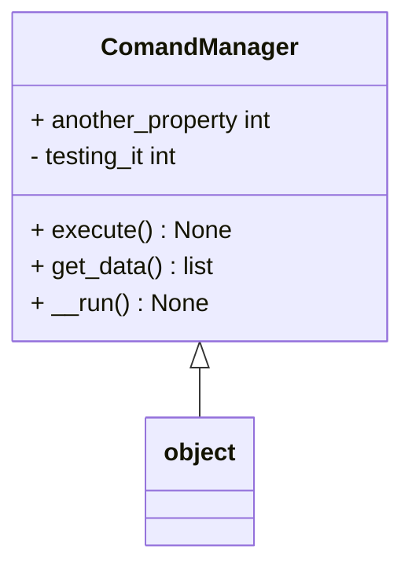

```mermaid
classDiagram
   ComandManager <|-- object
   ComandManager : + another_property int
   ComandManager : - testing_it int
   ComandManager : + execute() None
   ComandManager : + get_data() list
   ComandManager : + __run() None
```
        