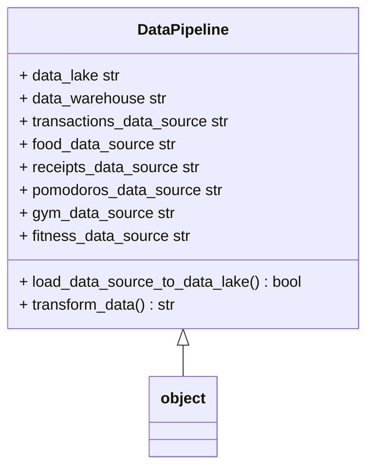

```mermaid
classDiagram
   DataPipeline <|-- object
   DataPipeline : + data_lake str
   DataPipeline : + data_warehouse str
   DataPipeline : + transactions_data_source str
   DataPipeline : + food_data_source str
   DataPipeline : + receipts_data_source str
   DataPipeline : + pomodoros_data_source str
   DataPipeline : + gym_data_source str
   DataPipeline : + fitness_data_source str
   DataPipeline : + load_data_source_to_data_lake() bool
   DataPipeline : + transform_data() str
```
        