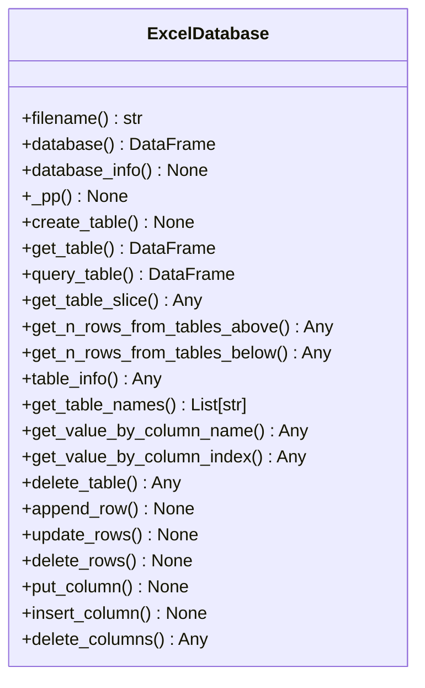

# Design Overview

```mermaid
classDiagram
   ExcelDatabase : +filename() str
   ExcelDatabase : +database() DataFrame
   ExcelDatabase : +database_info() None
   ExcelDatabase : +_pp() None
   ExcelDatabase : +create_table() None
   ExcelDatabase : +get_table() DataFrame
   ExcelDatabase : +query_table() DataFrame
   ExcelDatabase : +get_table_slice() Any
   ExcelDatabase : +get_n_rows_from_tables_above() Any
   ExcelDatabase : +get_n_rows_from_tables_below() Any
   ExcelDatabase : +table_info() Any
   ExcelDatabase : +get_table_names() List[str]
   ExcelDatabase : +get_value_by_column_name() Any
   ExcelDatabase : +get_value_by_column_index() Any
   ExcelDatabase : +delete_table() Any
   ExcelDatabase : +append_row() None
   ExcelDatabase : +update_rows() None
   ExcelDatabase : +delete_rows() None
   ExcelDatabase : +put_column() None
   ExcelDatabase : +insert_column() None
   ExcelDatabase : +delete_columns() Any
```
        
