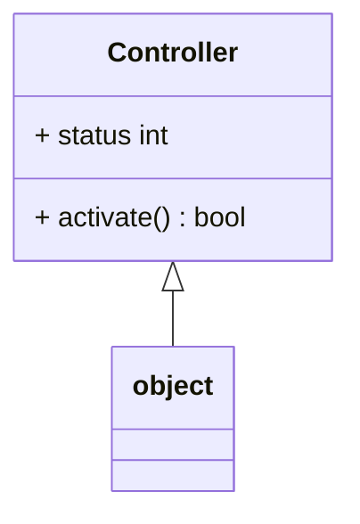

```mermaid
classDiagram
   CodeReader(ABC) <|-- ABC
   CodeReader(ABC) : - source_code_path Path
   CodeReader(ABC) : - response_code_path Path
   CodeReader(ABC) : + source_code_path() Path
   CodeReader(ABC) : + response_code_path() Path
   CodeReader(ABC) : + set_response_code_path() 
   CodeReader(ABC) : + set_source_code_path() 
   CodeReader(ABC) : + read() None
```
        


        